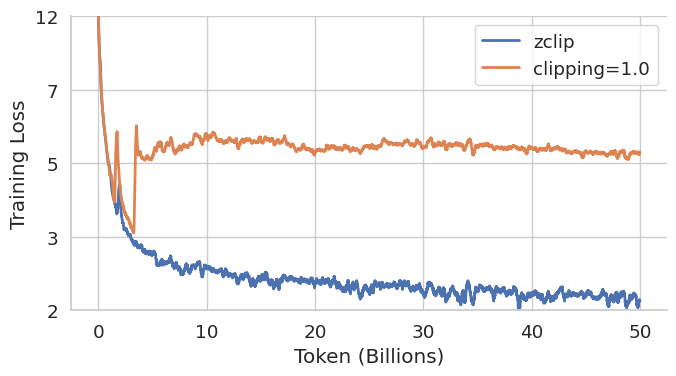
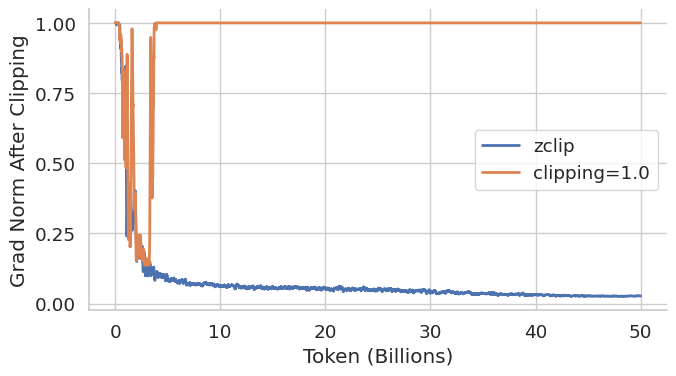

# ZClip: Adaptive Gradient Clipping

ZClip is an adaptive gradient clipping strategy designed to reduce loss spikes during large language model (LLM) pretraining. It combines exponential moving average (EMA) tracking with statistical anomaly detection to determine clipping thresholds dynamically.

[📄 Read the full paper](https://your-paper-link-here.com)

---

## 🧠 Algorithm Overview

ZClip mitigates gradient spikes by maintaining running statistics of gradient norms using Exponential Moving Averages (EMA). At each training step, it updates both the mean and variance of the gradient norm without storing the full history. This allows the algorithm to adaptively respond to sudden changes in training dynamics.

When the current gradient norm significantly deviates from the historical trend, ZClip dynamically computes a clipping threshold based on the observed variance. This ensures that extremely large gradient updates—often responsible for loss spikes—are automatically suppressed without requiring static thresholds.

By continuously adjusting to the scale and variability of gradients throughout training, ZClip maintains both stability and learning efficiency even under high learning rates or aggressive schedules.

---

## 📉 Example Impact

<table>
<tr>
<td align="center">

<br><b>Training Loss</b>
</td>
<td align="center">

<br><b>Gradient Norm after Clipping</b>
</td>
</tr>
</table>

---

## ⚙️ Implementation Details

Our code is built within the PyTorch Lightning framework, utilizing its callback system for efficient integration into the training pipeline.

You can also use ZClip directly with standard PyTorch by calling `.step(model)` after `loss.backward()` and before `optimizer.step()`.

---

## 🧪 Usage

### PyTorch
```python
from zclip import ZClip

zclip = ZClip(mode="zscore", alpha=0.97, z_thresh=2.5, clip_factor=1.0)

for batch in dataloader:
    optimizer.zero_grad()
    loss = model(batch)
    loss.backward()
    zclip.step(model)
    optimizer.step()
```

### PyTorch Lightning
```python
from zclip_callback import ZClipCallback

zclip_cb = ZClipCallback(mode="zscore", alpha=0.97, z_thresh=2.5, clip_factor=1.0)

trainer = pl.Trainer(
    max_epochs=3,
    callbacks=[zclip_cb]
)

trainer.fit(model, dataloader)
```

---

## 🔍 ZClip Parameters

| Argument        | Description                                                 | Default |
|----------------|-------------------------------------------------------------|---------|
| `mode`         | "zscore" or "percentile" clipping mode                      | zscore  |
| `z_thresh`     | Z-score threshold (used if mode=zscore)                    | 2.5     |
| `percentile`   | Percentile value (used if mode=percentile)                 | 0.99    |
| `alpha`        | EMA smoothing factor                                        | 0.97    |
| `clip_factor`  | Multiplier for std when clipping                           | 1.0     |
| `warmup_steps` | Number of steps to initialize EMA statistics               | 25      |

---

## 📊 Benefits

- Prevents catastrophic loss spikes
- Enables higher learning rates
- No manual tuning of static thresholds
- Compatible with PyTorch and PyTorch Lightning

---

## 📜 License
MIT License
